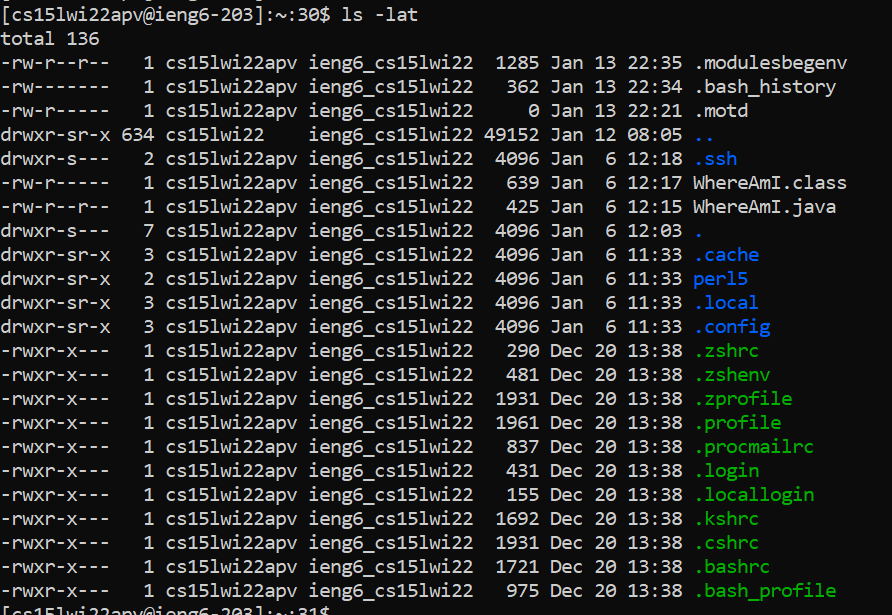
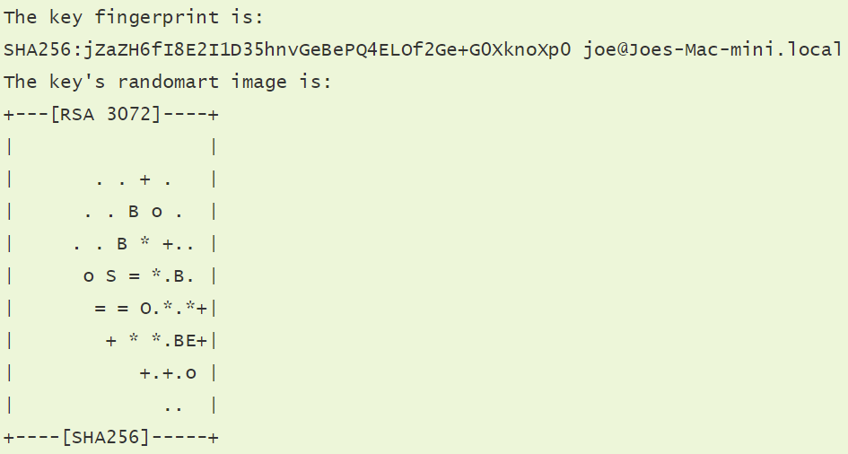

# Logging into ieng6
Rohun Kulshrestha

***
## Step One: Instaling VSCode ##
Download Visual Stuido Code from this [Link](https://code.visualstudio.com) and install it to your computer. When it is finished installing, open it and start setting it up by downloading any extension packs you think you might need. Some examples include:
* Java Packs
* Themes
* GitHub Packs

Once setup, your screen might look like this:


From here you can open a folder to begin working on files by clicking the icon next to the "Open Editor" header.

***
## Step Two: Working Remotely ##
In order to move files from your computer to a server, the first thing we will need to do is install OpenSSH [here](https://docs.microsoft.com/en-us/windows-server/administration/openssh/openssh_install_firstuse). Once downloaded, open Visual Studio (if not already open) and create a new terminal (reference image for help).


Once opened, go to [this link](https://sdacs.ucsd.edu/~icc/index.php) to look up your course-specific account for CSE15L. Then, go back to the terminal and enter this command to connect to the server:
```
ssh cs15lwi22zzz@ieng6.ucsd.edu
```
> NOTE: you would type your three letters in your account instead of "zzz"
 
 You may also be prompted with a message regarding security if this is the first time you are connecting. Just type "yes" to continue. If you are asked this again while connecting to the same server, there could be cause for concern. But for now there should be nothing to worry about. From there, you should be seeing a screen *similar* to the one below.

 

 ***
## Step Three: Trying Some Commands ##
Once set up in the server, try running some of these commands that provide some interesting information :
* cd ~
* cd
* ls -lat
* ls -a
* type "exit" to log out of the remote server or 'CTRL + D'

An example of the 'ls -lat' command



***
## Step Four: Moving Files with SCP ##
Now we will try sending over a copy of a file from our computer to a remote computer using the "SCP" command. This command will alwyas be ran on the client - the computer not logged into ieng6. To test this command out, begin by creating a new file on your computer called "WhereAmI.java" and past the following code into it:
```
class WhereAmI {
  public static void main(String[] args) 
  {
    System.out.println(System.getProperty("os.name"));
    System.out.println(System.getProperty("user.name"));
    System.out.println(System.getProperty("user.home"));
    System.out.println(System.getProperty("user.dir"));
  }
}
```
run it using the "Javac" and "Java" commands and note the output.
Now we will copy it to the server using this command:
```
scp WhereAmI.java cs15lwi22zzz@ieng6.ucsd.edu:~/
```
remember to replace "zzz" with your course-specific letters
>NOTE: You may be prompted to enter your password

Once copied to the server, log into ieng6 using the steps from above and type in the "ls" command. You should see the file there in the directory similar to the picture below.


Now, once again, run the "Javac" and "Java" commands on the server and note the difference in the output. You have succesfully copied a file to the server, congrats!

 ***

## Step Five: Setting an SSH Key ##
By now we have logged into the server multiple times, and I am sure you have noticed each time we want to do so, we are asked to provide our pasword. This repetitive task can get quite frustrating. Luckily, there is a solution to this problem and it comes in the form of a simple command: SSH.

As Professor Polits describes it:
>" The idea behind ssh keys is that a program, called ssh-keygen, creates a pair of files called the public key and private key. You copy the public key to a particular location on the server, and the private key in a particular location on the client. Then, the ssh command can use the pair of files in place of your password "

This useful command will help us save an ample amount of time, and annoyance, in the long run.

To begin, go back to the terminal on your computer (the client) and run the following command:
>ssh-keygen

when prompted with a space to save the key, enter something similar to this:

>/Users/yourname/.ssh/id_rsa

You should be at screen *similar* to this:


Now, you have created two keys. A public key as well as a private key. Both stored in the .ssh directory of your computer.
Now, we need to copy the **public** key to the directory on the ieng6 server directory. So once again, connect to the server and navigate to the .ssh directory by running this command:
>mkdir .ssh

Then, logout of the server and run the following command on your computer's terminal:
>scp /Users/yourname/.ssh/id_rsa.pub cs15lwi22@ieng6.ucsd.edu:~/.ssh/authorized_keys

Once completed, you should now be able to run any "scp" or "ssh" commands from your computer without having to use your password!

***
## Step Six: Optimizing Remove Running ##
When working back and forth with the server and client, you may find it time consuming to constantly be typing commands. While, the scp command diminished some of that, there are other ways to streamline efficiency as well. 

* Using the up-arrow in the terminal is one good way to quickly run a command you have already ran.
* Conjoining multiple commands on one line seperating them with a ";". Thus, running them at the same time.
* and more

(optimized)


## VS ##


(not optimized)


***
Thank You!