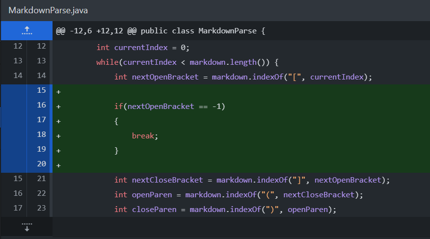
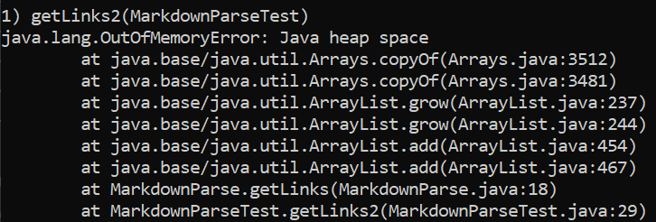
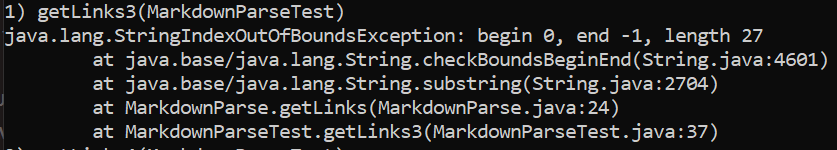
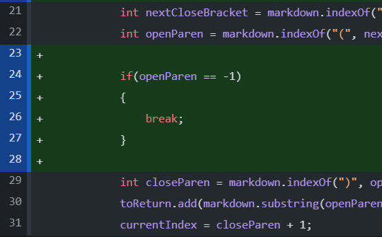
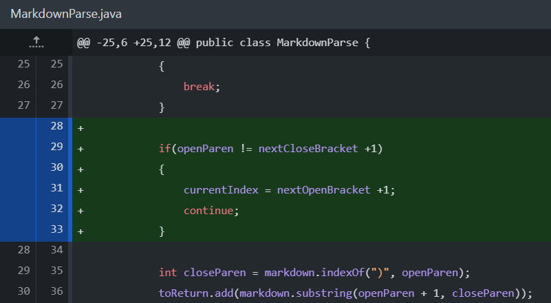
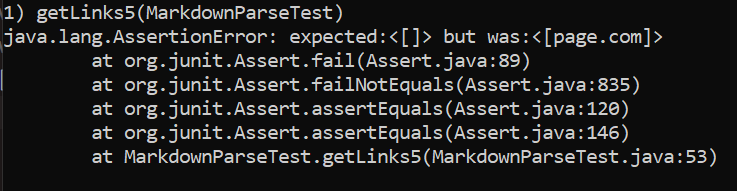

# Week 4 Lab Report #
Rohun Kulshrestha

***
## Part 1 ##
The first test file I will be presenting is [test-file2](test-file2.md). Me and my lab group came up with this as a solution to the problem:

after seeing these symptoms when it was run for the first time:

This failure-inducing input file contains two links with both brackets and parenthesis, except, after both links is additional text. This additional text causes the program to keep looking for paranthesis when there are none, which results in the symptom pitcured above. To fix this bug, I simply had to add a break in the code to occur if the value of nextOpenBracket is -1 before checking for a closed bracket.

***

## Part 2 ##
The second test file I chose is [test-file3](test-file3.md), and after seeing these symptoms:

Me and my lab came up with this solution:

The failure-inducing input file contains additional text after the closed bracket, which is fine except the additional text does not contain any open parenthesis. Because of that, after running the test, a value of -1 is returned that results in a symptom that displays a StringIndexOutOfBounds exception. To fix this bug, I simply allowed for a break in the code if a value of -1 for the "openParen" variable was ever returned. 

***
## Part 3 ##
The third, and final, test case I will attempt to solve is [test-file5](test-file5.md). The solution my lab and I came up with was:

to this symptom that was recorded in the output when the automated tests were run:

This failure-inducing input file contains text in closed brackets and a link in open parenthesis; however, the two are not related as there is random text in between them. Because of this, the program skipped the text and assumed the link in the open parenthesis was related to the brackets. The symptom that displayed after running the code showed us this was the issue as it returned the link despite there being no valid link to return. To fix this bug, I added a portion of code that checked whether an openParen was located 1 value after the nextCLosedBracket, which ended up being a viable solution to the problem.

***

Thank you!

