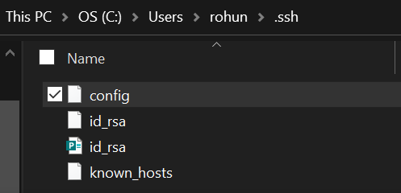
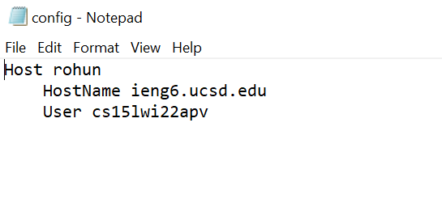
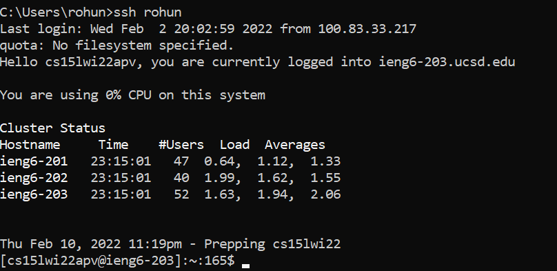
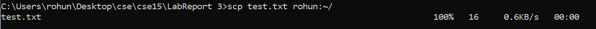

# Streamlining SSH configuration
Rohun Kulshrestha

***
## Streamlining SSH configuration ##
By now we have been logging in and out of ieng6 quite a bit in this class, and, for the most part, it's been some-what of a hassle having to type in that lengthy course-specific id every time. Especially, if you can't remember the entire wordage every time. That is why I chose this option out of those presented.

The first step was to locate the ssh directory, which I found in my C drive:

From there, I simply created a new `config` file and edited it using the notepad feature:

By entering my name after the words "Host", I was able to set-up a nickname to be used everytime I log into the ineg6 servers (shown on the first line of the picture below) rather than that lengthy course-specific one shown after "User":

This newly-created key also works when using commands such as `scp`:

By setting up this streamlined approach of logging into ieng6, I am now able to save time when logging in. Plus, it is simply just easier to remember and type in!

***
Thank you!

