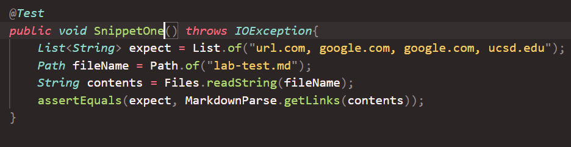
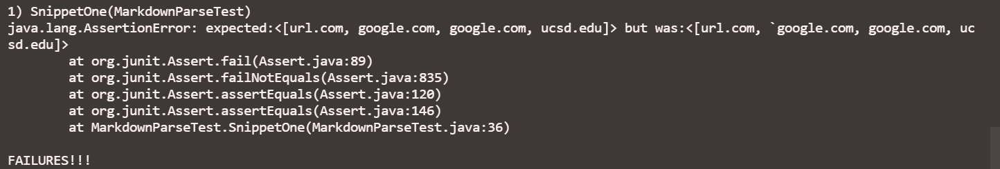
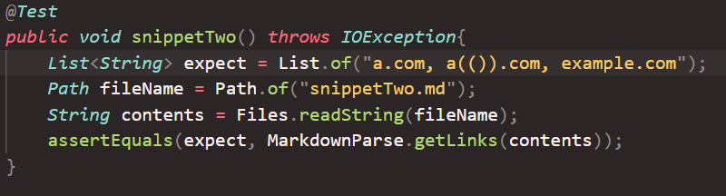
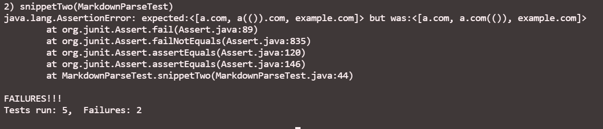
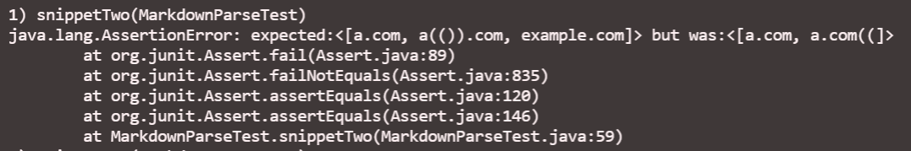
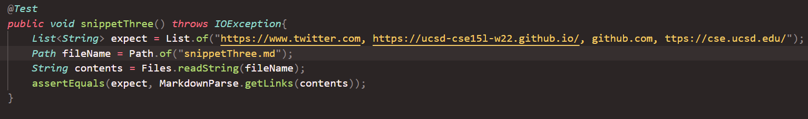
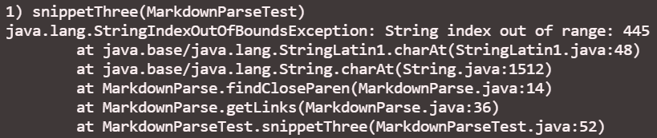
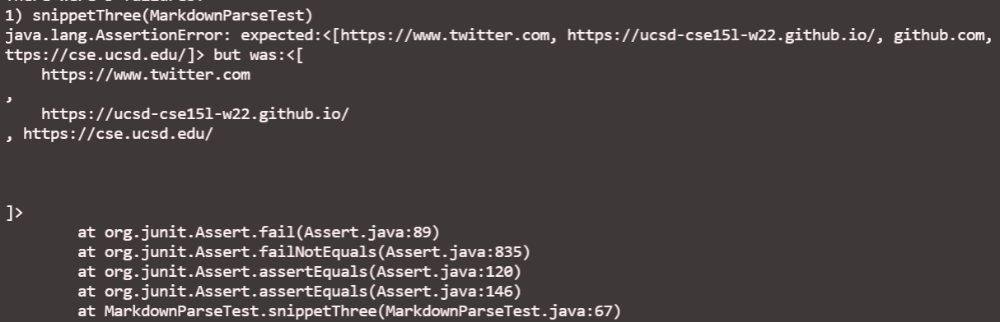

# MarkdownParse Test
Rohun Kulshrestha

[Link to my Markdown-Parse](https://github.com/rohunkulshrestha/markdown-parse-1)

[Link to reviewed Markdown-Parse](https://github.com/christopherthomason/markdown-parse)

***
## Snippet One ##

I began by creating a new test file for snippet one named "snippetOne", and this is the JUnit test I added to MarkdownParseTest with the expected output:

I then ran the tests, which resulted in this failed output for my MarkdownParseTest:

And this failed output for the MarkdownParseTest of the file I reviewed:

***

## Snippet Two ##

I then repeated the same process for snippet two by creating a test file named "snippetTwo" with the following JUnit test:

This was the failed output received for my MarkdownParseTest:

While this was the failed output recieved for the one I reveiewed:

***

## Snippet Three ##

Lastly, I created a test file named "snippetThree" with this corresponding JUnit test:

Which resulted in this output for my MarkdownParseTest:

And this output for the one I reviewed:

***

## Questions ##

***Snippet One*** - For snippet one I believe a more complex code change would be needed to fix a link with back ticks in it. This is beacause most of MarkdownParse deals with finding parentheses or brackets, so looking for something like a backtick would involve more than just a few extra lines of code.

***Snippet Two*** - For snippet two, dealing with something like a nested parentheses could be fixed by including an additional if-statement. By adding code that looks for two consecutive uses of an open-parentheses and then correspondingly updates the index count by skipping the second open-parentheses could lead to the omition of the nest in the output.

***Snippet Three*** - For snippet three, if there was a function that removed any line breaks similar to the string function that removes spaces, then MarkdownParse could call that function before running the test. This could remove any obstacles that the prorgram runs into while running that are not accounted for.

***

Thank you!
