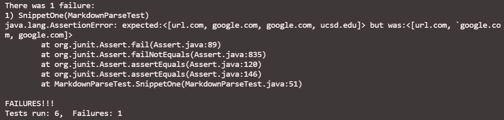

# Week 8 Lab Report
Rohun Kulshrestha

***
## Snippet One ##

[Link to my Markdown-Parse](https://github.com/rohunkulshrestha/markdown-parse-1)

[Link to reviewed Markdown-Parse](https://github.com/christopherthomason/markdown-parse)

I began by creating a new test file for snippet one named "snippetOne", and this is the JUnit test I added to MarkdownParseTest with the expected output:

I then ran the tests, which resulted in this failed output for my MarkdownParseTest:

And this failed output for the MarkdownParseTest of the file I reviewed:

