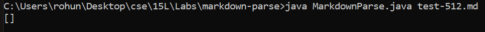
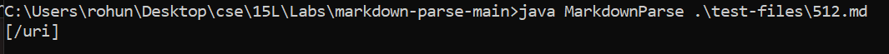
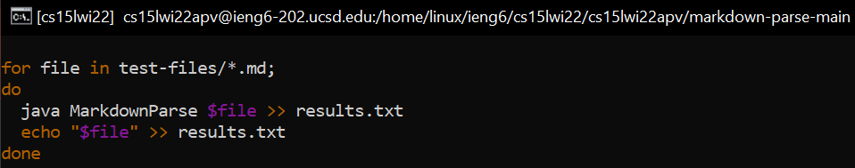
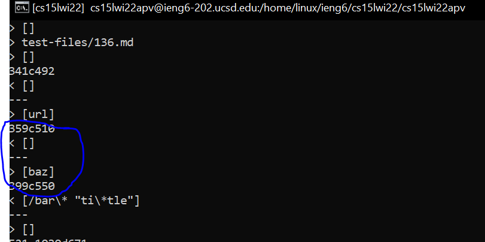
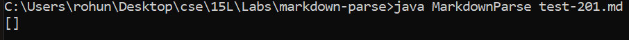
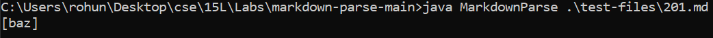

# Week 10 Lab Report
Rohun Kulshrestha

***

## Test One ##
For the first test, I chose file 512 by manually looking at the different files and their contents. Then I ran a couple that might produce different outputs, which led me to finding [512.md](512.md).

When I ran the test using my MarkdownParse, this was the output that was produced:

Versus when I ran the test using the provided MarkdownParse:

As you can see, the two outputs are different, but I beilieve that the output produced by the provided MarkdownParse code, `[/uri]` is the expected output. The problem in my MarkdownParse may be occuring after the program is done finding the closed bracket. If you look back at the test, there is an additional closed bracket, which may be causing the program to produce this incorrect output. 

As of now, the program really only accounts for one closed bracket; thus, the additional closed bracket is causing the program to produce the output we are seeing.

## Test Two ##
 For test two I compared the results of the provided repostiory with my repository using the `diff` command. To do this I edited the `script.sh` file in both repositories with the following updates:

 

Now whenever I ran the `bash script.sh` command it would copy all the contents of the produced outputs into a text file named *results* along with the name of the tests. Then, I returned back to the terminal and ran

> diff markdown-parse/results.txt markdown-parse-main/results.txt

which produced this (partial) output:

and from there I found that test [201.md](201.md) resulted in a different output between mine and the provided MarkdownParse implementations. 

The output displayed from my repository:

versus the one displayed from the provided repository:

Between the two outputs, `[] and [baz]`, I believe the correct output to be `[]`, the one produced by my groups repository. I believe this is the correct output because if you look back at the [test file](201.md) you can see that the file does not actually have a valid link. The potential bug is most likely occuring somewhere in this block of code: 

As you can see from the above image, the code checks whether there is a space inside the link, but does not account for the fact that there could be a gap between the closed parentheses and open bracket, which would in turn regard it as an invalid link. 

***
In conclusion, after attempting to find an instance of different outputs between two implementations of different programs both manually and autonomously, I can confidently say using `.sh` files and commands such as `bash` and `diff` make such tasks tremendously less tedious and save amples amount of time.

***
Thank You!!

